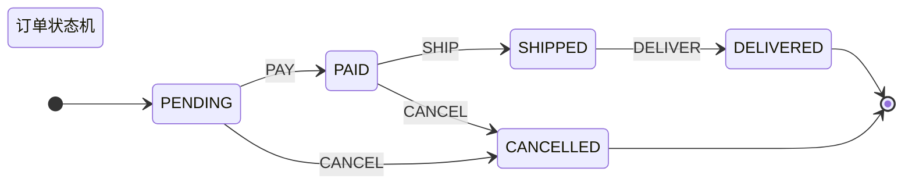

# 状态机设计模式框架

## 概述

本框架提供了一个完整的状态机设计模式实现，旨在简化外部项目中状态机的实现和使用。框架采用了现代Java设计模式，支持泛型、线程安全、可扩展性和高性能。

## 核心特性

- **泛型支持**：支持自定义上下文、事件和结果类型
- **线程安全**：内置并发控制，支持多线程环境
- **灵活配置**：支持单例和原型两种状态创建模式
- **条件转换**：支持基于条件的状态转换
- **生命周期管理**：完整的状态进入/退出回调
- **性能监控**：内置性能统计和监控功能
- **可视化支持**：支持生成Mermaid状态图
- **构建器模式**：提供流畅的API进行状态机配置

## 核心组件

### 1. 核心接口

- **IState<C, E, R>**：状态接口，定义状态的基本行为
- **IStateContext<C, E, R>**：状态上下文接口，管理状态机的运行时状态

### 2. 抽象实现

- **AbstractState<C, E, R>**：状态的抽象实现，提供通用功能
- **AbstractStateContext<C, E, R>**：状态上下文的抽象实现

### 3. 管理组件

- **StateMachine**：状态机管理器，采用单例模式
- **StateFactory<C, E, R>**：状态工厂，管理状态实例的创建
- **StateTransition<C, E, R>**：状态转换器，定义转换规则

### 4. 构建工具

- **StateMachineBuilder<C, E, R>**：状态机构建器，提供流畅API
- **StateMachineConfig**：状态机配置类
- **MermaidDiagramGenerator<C, E, R>**：Mermaid图表生成器

## 快速开始

### 1. 定义事件枚举

```java
public enum OrderEvent {
    CREATE,
    PAY,
    SHIP,
    DELIVER,
    CANCEL
}
```

### 2. 定义上下文数据

```java
public class OrderContext {
    private String orderId;
    private BigDecimal amount;
    private String customerId;
    
    // 构造函数、getter和setter
    public OrderContext(String orderId, BigDecimal amount, String customerId) {
        this.orderId = orderId;
        this.amount = amount;
        this.customerId = customerId;
    }
    
    // getter和setter方法...
}
```

### 3. 实现具体状态

```java
public class PendingState extends AbstractState<OrderContext, OrderEvent, String> {
    
    @Override
    public String getStateName() {
        return "PENDING";
    }
    
    @Override
    protected boolean canHandle(IStateContext<OrderContext, OrderEvent, String> context, OrderEvent event) {
        return event == OrderEvent.PAY || event == OrderEvent.CANCEL;
    }
    
    @Override
    protected String doHandle(IStateContext<OrderContext, OrderEvent, String> context, OrderEvent event) {
        switch (event) {
            case PAY:
                return "订单支付成功";
            case CANCEL:
                return "订单已取消";
            default:
                return "不支持的操作";
        }
    }
    
    @Override
    public void onEnter(IStateContext<OrderContext, OrderEvent, String> context) {
        System.out.println("进入待支付状态");
    }
    
    @Override
    public void onExit(IStateContext<OrderContext, OrderEvent, String> context) {
        System.out.println("离开待支付状态");
    }
}

public class PaidState extends AbstractState<OrderContext, OrderEvent, String> {
    
    @Override
    public String getStateName() {
        return "PAID";
    }
    
    @Override
    protected boolean canHandle(IStateContext<OrderContext, OrderEvent, String> context, OrderEvent event) {
        return event == OrderEvent.SHIP || event == OrderEvent.CANCEL;
    }
    
    @Override
    protected String doHandle(IStateContext<OrderContext, OrderEvent, String> context, OrderEvent event) {
        switch (event) {
            case SHIP:
                return "订单已发货";
            case CANCEL:
                return "订单已取消（需要退款）";
            default:
                return "不支持的操作";
        }
    }
}

public class ShippedState extends AbstractState<OrderContext, OrderEvent, String> {
    
    @Override
    public String getStateName() {
        return "SHIPPED";
    }
    
    @Override
    protected boolean canHandle(IStateContext<OrderContext, OrderEvent, String> context, OrderEvent event) {
        return event == OrderEvent.DELIVER;
    }
    
    @Override
    protected String doHandle(IStateContext<OrderContext, OrderEvent, String> context, OrderEvent event) {
        if (event == OrderEvent.DELIVER) {
            return "订单已送达";
        }
        return "不支持的操作";
    }
}

public class DeliveredState extends AbstractState<OrderContext, OrderEvent, String> {
    
    @Override
    public String getStateName() {
        return "DELIVERED";
    }
    
    @Override
    protected boolean canHandle(IStateContext<OrderContext, OrderEvent, String> context, OrderEvent event) {
        return false; // 终止状态，不处理任何事件
    }
    
    @Override
    protected String doHandle(IStateContext<OrderContext, OrderEvent, String> context, OrderEvent event) {
        return "订单已完成";
    }
}

public class CancelledState extends AbstractState<OrderContext, OrderEvent, String> {
    
    @Override
    public String getStateName() {
        return "CANCELLED";
    }
    
    @Override
    protected boolean canHandle(IStateContext<OrderContext, OrderEvent, String> context, OrderEvent event) {
        return false; // 终止状态，不处理任何事件
    }
    
    @Override
    protected String doHandle(IStateContext<OrderContext, OrderEvent, String> context, OrderEvent event) {
        return "订单已取消";
    }
}
```

### 4. 构建状态机

```java
public class OrderStateMachineExample {
    
    public static void main(String[] args) {
        // 创建状态机
        IStateContext<OrderContext, OrderEvent, String> stateMachine = StateMachineBuilder
                .<OrderContext, OrderEvent, String>newBuilder("OrderStateMachine")
                // 注册状态
                .addState("PENDING", new PendingState())
                .addState("PAID", new PaidState())
                .addState("SHIPPED", new ShippedState())
                .addState("DELIVERED", new DeliveredState())
                .addState("CANCELLED", new CancelledState())
                // 定义状态转换
                .addTransition("PENDING", "PAID", OrderEvent.PAY)
                .addTransition("PENDING", "CANCELLED", OrderEvent.CANCEL)
                .addTransition("PAID", "SHIPPED", OrderEvent.SHIP)
                .addTransition("PAID", "CANCELLED", OrderEvent.CANCEL)
                .addTransition("SHIPPED", "DELIVERED", OrderEvent.DELIVER)
                // 设置初始状态
                .initialState("PENDING")
                // 启用日志
                .enableTransitionLogging(true)
                .enableLifecycleCallbacks(true)
                // 设置转换监听器
                .onTransition((context, oldState, newState) -> {
                    System.out.println(String.format("状态转换: %s -> %s", 
                        oldState != null ? oldState.getStateName() : "null", 
                        newState != null ? newState.getStateName() : "null"));
                })
                // 构建状态机
                .buildContext(new OrderContext("ORDER-001", new BigDecimal("99.99"), "CUSTOMER-001"));
        
        // 使用状态机
        System.out.println("当前状态: " + stateMachine.getCurrentState().getStateName());
        
        // 处理事件
        String result1 = stateMachine.handleRequest(OrderEvent.PAY);
        System.out.println("支付结果: " + result1);
        System.out.println("当前状态: " + stateMachine.getCurrentState().getStateName());
        
        String result2 = stateMachine.handleRequest(OrderEvent.SHIP);
        System.out.println("发货结果: " + result2);
        System.out.println("当前状态: " + stateMachine.getCurrentState().getStateName());
        
        String result3 = stateMachine.handleRequest(OrderEvent.DELIVER);
        System.out.println("送达结果: " + result3);
        System.out.println("当前状态: " + stateMachine.getCurrentState().getStateName());
    }
}
```

## 高级特性

### 1. 条件转换

```java
// 添加带条件的状态转换
builder.addTransition("PAID", "SHIPPED", OrderEvent.SHIP, 
    context -> {
        OrderContext orderContext = context.getContextData();
        return orderContext.getAmount().compareTo(new BigDecimal("100")) > 0;
    });
```

### 2. 状态工厂模式

```java
// 使用原型模式创建状态
builder.addState("PENDING", () -> new PendingState());

// 使用状态类
builder.addState("PAID", PaidState.class);
```

### 3. 配置管理

```java
// 创建自定义配置
StateMachineConfig config = StateMachineConfig.developmentConfig();
config.setTransitionTimeoutMs(10000L);
config.setMaxStateMachines(500);
config.setLogLevel(StateMachineConfig.LogLevel.DEBUG);

// 应用配置（需要在StateMachine中添加配置支持）
```

### 4. 状态图可视化

```java
// 生成Mermaid状态图
MermaidDiagramGenerator<OrderContext, OrderEvent, String> generator = 
    MermaidDiagramGenerator.create(stateFactory, transitions);

String diagram = generator
    .setTitle("订单状态机")
    .setInitialState("PENDING")
    .addFinalState("DELIVERED")
    .addFinalState("CANCELLED")
    .setDirection(MermaidDiagramGenerator.Direction.LEFT_RIGHT)
    .showEventLabels(true)
    .showConditionLabels(true)
    .generateStateDiagram();

System.out.println(diagram);
```

生成的Mermaid图表：



## 最佳实践

### 1. 状态设计原则

- **单一职责**：每个状态只处理特定的业务逻辑
- **开闭原则**：通过继承扩展状态，而不是修改现有状态
- **状态封装**：将状态相关的数据和行为封装在状态类中

### 2. 错误处理

```java
public class RobustState extends AbstractState<OrderContext, OrderEvent, String> {
    
    @Override
    protected String doHandle(IStateContext<OrderContext, OrderEvent, String> context, OrderEvent event) {
        try {
            // 业务逻辑
            return processEvent(context, event);
        } catch (BusinessException e) {
            // 业务异常处理
            logger.warn("业务异常: {}", e.getMessage());
            return "处理失败: " + e.getMessage();
        } catch (Exception e) {
            // 系统异常处理
            logger.error("系统异常", e);
            return "系统错误";
        }
    }
    
    private String processEvent(IStateContext<OrderContext, OrderEvent, String> context, OrderEvent event) {
        // 具体业务逻辑
        return "处理成功";
    }
}
```

### 3. 性能优化

- 使用单例模式创建无状态的状态实例
- 合理设置状态机配置参数
- 避免在状态转换中执行耗时操作
- 使用异步处理长时间运行的任务

### 4. 测试策略

```java
@Test
public void testOrderStateMachine() {
    // 创建测试状态机
    IStateContext<OrderContext, OrderEvent, String> stateMachine = createTestStateMachine();
    
    // 测试初始状态
    assertEquals("PENDING", stateMachine.getCurrentState().getStateName());
    
    // 测试状态转换
    String result = stateMachine.handleRequest(OrderEvent.PAY);
    assertEquals("订单支付成功", result);
    assertEquals("PAID", stateMachine.getCurrentState().getStateName());
    
    // 测试无效转换
    String invalidResult = stateMachine.handleRequest(OrderEvent.DELIVER);
    assertNull(invalidResult); // 或者根据实现返回错误信息
    assertEquals("PAID", stateMachine.getCurrentState().getStateName()); // 状态不变
}
```

## 与其他设计模式的集成

本状态机框架可以与项目中的其他设计模式很好地集成：

### 1. 与责任链模式集成

```java
// 在状态处理中使用责任链
public class ChainIntegratedState extends AbstractState<OrderContext, OrderEvent, String> {
    
    private final ILogicChainArmory<OrderContext, String> chainArmory;
    
    @Override
    protected String doHandle(IStateContext<OrderContext, OrderEvent, String> context, OrderEvent event) {
        // 使用责任链处理复杂业务逻辑
        return chainArmory.next("orderProcessChain").logic(context.getContextData());
    }
}
```

### 2. 与策略模式集成

```java
// 在状态中使用策略模式
public class StrategyIntegratedState extends AbstractState<OrderContext, OrderEvent, String> {
    
    private final StrategyMapper<String, OrderContext, String> strategyMapper;
    
    @Override
    protected String doHandle(IStateContext<OrderContext, OrderEvent, String> context, OrderEvent event) {
        // 根据事件类型选择不同的处理策略
        String strategyKey = event.name().toLowerCase();
        return strategyMapper.get(strategyKey).process(context.getContextData());
    }
}
```

## 常见问题

### Q1: 如何处理并发访问？

A: 框架内置了线程安全机制，使用`ConcurrentHashMap`和同步块确保并发安全。如果需要更细粒度的控制，可以在状态实现中添加额外的同步机制。

### Q2: 如何扩展状态机功能？

A: 可以通过以下方式扩展：
- 继承`AbstractState`实现自定义状态
- 继承`AbstractStateContext`实现自定义上下文
- 实现`StateMachine.StateTransitionListener`添加自定义监听器

### Q3: 如何持久化状态机状态？

A: 框架本身不提供持久化功能，但可以通过以下方式实现：
- 在状态转换监听器中保存状态
- 在上下文中添加持久化逻辑
- 集成Spring等框架的事务管理

## 版本历史

- **v1.0** - 初始版本，提供基础状态机功能

## 许可证

本框架遵循项目的整体许可证。

## 贡献

欢迎提交Issue和Pull Request来改进本框架。