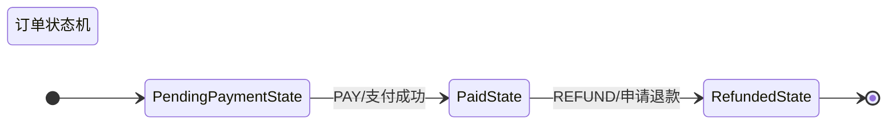
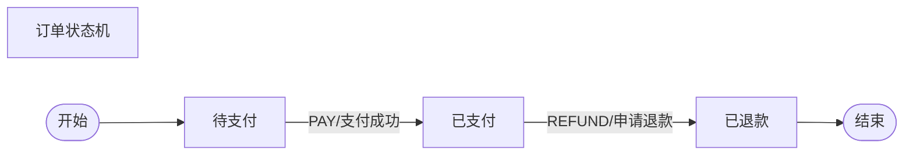

# MermaidDiagramGenerator 使用说明

`MermaidDiagramGenerator` 是一个用于生成状态机可视化图表的工具类，可以将状态机转换为 Mermaid 格式的图表代码，支持在 GitHub、GitLab、Notion 等平台上渲染显示。

## 核心功能

### 1. 支持的图表类型
- **状态图 (State Diagram)**: 展示状态之间的转换关系
- **流程图 (Flowchart)**: 展示业务流程的执行路径

### 2. 配置选项
- **图表标题**: `setTitle(String title)`
- **图表方向**: `setDirection(Direction direction)`
  - `TOP_DOWN`: 从上到下
  - `LEFT_RIGHT`: 从左到右
  - `BOTTOM_UP`: 从下到上
  - `RIGHT_LEFT`: 从右到左
- **初始状态**: `setInitialState(String stateName)`
- **终止状态**: `addFinalState(String stateName)`
- **显示选项**:
  - `showEventLabels(boolean)`: 是否显示事件标签
  - `showConditionLabels(boolean)`: 是否显示条件标签
  - `showPriority(boolean)`: 是否显示优先级

## 基本用法

### 步骤 1: 准备状态转换数据

```java
// 1. 创建状态工厂
StateFactory<OrderContext, OrderEvent, String> stateFactory = OrderStateFactory.getInstance();

// 2. 定义状态转换规则
List<StateTransition<OrderContext, OrderEvent, String>> transitions = new ArrayList<>();

// 添加转换规则：待支付 -> 已支付
transitions.add(StateTransition.<OrderContext, OrderEvent, String>builder()
    .fromState("PendingPaymentState")
    .toState("PaidState")
    .triggerEvent(OrderEvent.PAY)
    .description("支付成功")
    .priority(1)
    .build());

// 添加转换规则：已支付 -> 已退款
transitions.add(StateTransition.<OrderContext, OrderEvent, String>builder()
    .fromState("PaidState")
    .toState("RefundedState")
    .triggerEvent(OrderEvent.REFUND)
    .description("申请退款")
    .priority(1)
    .build());
```

### 步骤 2: 创建图表生成器

```java
// 创建 Mermaid 图表生成器
MermaidDiagramGenerator<OrderContext, OrderEvent, String> generator = 
    MermaidDiagramGenerator.create(stateFactory, transitions)
        .setTitle("订单状态机")                    // 设置标题
        .setDirection(Direction.LEFT_RIGHT)        // 设置方向
        .setInitialState("PendingPaymentState")    // 设置初始状态
        .addFinalState("RefundedState")            // 添加终止状态
        .showEventLabels(true)                     // 显示事件标签
        .showConditionLabels(false)                // 不显示条件标签
        .showPriority(false);                      // 不显示优先级
```

### 步骤 3: 生成图表代码

```java
// 生成状态图
String stateDiagram = generator.generateStateDiagram();
System.out.println(stateDiagram);

// 生成流程图
String flowchart = generator.generateFlowchart();
System.out.println(flowchart);

// 生成 Markdown 文档
String markdown = generator.generateMarkdown();
System.out.println(markdown);
```

## 输出示例

### 状态图输出


### 流程图输出


## 实际应用场景

### 1. 文档生成
在项目文档中嵌入状态机图表，帮助团队理解业务流程：

```java
@Test
public void generateDocumentation() {
    // 创建生成器
    MermaidDiagramGenerator<OrderContext, OrderEvent, String> generator = 
        createOrderStateMachineGenerator();
    
    // 生成文档
    String documentation = generator.generateMarkdown();
    
    // 保存到文件
    Files.write(Paths.get("docs/order-state-machine.md"), 
                documentation.getBytes());
}
```

### 2. 代码审查
在代码审查时提供可视化的状态转换图：

```java
@Test
public void reviewStateMachine() {
    // 生成简洁的状态图用于代码审查
    String diagram = MermaidDiagramGenerator.create(stateFactory, transitions)
        .setTitle("订单状态转换 - 代码审查")
        .showEventLabels(true)
        .showConditionLabels(false)
        .showPriority(false)
        .generateStateDiagram();
    
    System.out.println("请审查以下状态转换逻辑：");
    System.out.println(diagram);
}
```

### 3. 系统设计
在系统设计阶段可视化状态机架构：

```java
@Test
public void designSystemArchitecture() {
    // 生成详细的流程图用于系统设计
    String flowchart = MermaidDiagramGenerator.create(stateFactory, transitions)
        .setTitle("订单处理系统架构")
        .setDirection(Direction.TOP_DOWN)
        .showEventLabels(true)
        .showConditionLabels(true)
        .showPriority(true)
        .generateFlowchart();
    
    System.out.println("系统架构设计：");
    System.out.println(flowchart);
}
```

## 支持的渲染平台

生成的 Mermaid 代码可以在以下平台上渲染：

1. **GitHub**: 在 README.md 或 Issues 中直接使用
2. **GitLab**: 支持 Mermaid 图表渲染
3. **Notion**: 通过代码块支持 Mermaid
4. **Typora**: Markdown 编辑器，支持实时预览
5. **VS Code**: 通过 Mermaid 插件支持
6. **在线编辑器**: [Mermaid Live Editor](https://mermaid.live/)

## 最佳实践

### 1. 状态命名规范
- 使用清晰、描述性的状态名称
- 保持命名一致性
- 避免使用特殊字符

### 2. 图表配置建议
- **文档用途**: 显示事件标签，隐藏优先级
- **设计用途**: 显示所有标签和优先级
- **演示用途**: 使用简洁配置，突出主要流程

### 3. 性能考虑
- 对于复杂状态机，考虑分组显示
- 避免在单个图表中显示过多状态
- 使用合适的图表方向以提高可读性

## 完整示例

参考 `MermaidDiagramGeneratorExample.java` 文件中的完整示例代码，包含：
- 基础状态图生成
- 流程图生成
- 自定义样式配置
- 文件保存功能
- 使用指南

通过这些示例，您可以快速上手并根据实际需求定制图表生成逻辑。